<!-- mcp-name: io.github.egoughnour/curate-ipsum -->

# Curate-Ipsum

**A graph-spectral MCP server for verified code synthesis through belief revision**

[](https://pypi.org/project/curate-ipsum/)
[](https://registry.mcp.so/servers/io.github.egoughnour/curate-ipsum)
[](https://github.com/egoughnour/curate-ipsum/releases/latest/download/curate-ipsum.mcpb)
[](https://opensource.org/licenses/MIT)
[](https://pypi.org/project/curate-ipsum/)

[](https://github.com/egoughnour/curate-ipsum)
[](https://github.com/egoughnour/curate-ipsum)
[](https://github.com/egoughnour/curate-ipsum/commits/main)
[](https://github.com/egoughnour/curate-ipsum)

Curate-Ipsum bridges the gap between LLM-generated code (fast, plausible, unverified) and formally verified patches (slow, correct, trustworthy). It treats mutation testing as one component of a larger system for maintaining robust, self-healing codebase metadata that supports reachability analysis, symbolic execution, and automated test generation.

## Install

```bash
# PyPI
pip install curate-ipsum

# or with uv
uv pip install curate-ipsum

# Docker (includes baked-in embedding model)
docker pull ghcr.io/egoughnour/curate-ipsum:latest
```

### Claude Desktop / MCP Client

Add to your `claude_desktop_config.json`:

```json
{
  "mcpServers": {
    "curate-ipsum": {
      "command": "uvx",
      "args": ["curate-ipsum"]
    }
  }
}
```

Or with Docker (embedding model pre-loaded, no Python needed):

```json
{
  "mcpServers": {
    "curate-ipsum": {
      "command": "docker",
      "args": ["run", "-i", "--rm", "ghcr.io/egoughnour/curate-ipsum:latest"]
    }
  }
}
```

## MCP Tools

Curate-Ipsum exposes 30 tools over the MCP stdio transport, organised into six groups:

**Testing** — `run_unit_tests`, `run_integration_tests`, `run_mutation_tests`, `get_run_history`, `get_region_metrics`, `detect_frameworks`, `parse_region`, `check_region_relationship`, `create_region`

**Belief Revision** — `add_assertion`, `contract_assertion`, `revise_theory`, `get_entrenchment`, `list_assertions`, `get_theory_snapshot`, `store_evidence`, `get_provenance`, `why_believe`, `belief_stability`

**Rollback & Failure** — `rollback_to`, `undo_last_operations`, `analyze_failure`, `list_world_history`

**Graph-Spectral** — `extract_call_graph`, `compute_partitioning`, `query_reachability`, `get_hierarchy`, `find_function_partition`, `incremental_update`, `persistent_graph_stats`, `graph_query`

**Verification** — `verify_property` (Z3/angr), `verify_with_orchestrator` (CEGAR budget escalation), `list_verification_backends`

**Synthesis & RAG** — `synthesize_patch` (CEGIS + genetic + LLM), `synthesis_status`, `cancel_synthesis`, `list_synthesis_runs`, `rag_index_nodes`, `rag_search`, `rag_stats`

## Current Status

**Last Updated**: 2026-02-08

| Component | Status |
|-----------|--------|
| Multi-framework parsing (5 frameworks) | Complete |
| Graph Infrastructure (Spectral/Kameda) | Complete |
| Belief Revision Engine (AGM/Provenance) | Complete |
| Synthesis Loop (CEGIS/Genetic) | Complete |
| Verification Backends (Z3/angr) | Complete |
| Graph Persistence (SQLite/Kuzu) | Complete |
| RAG / Semantic Search (Chroma) | Complete |

## The Problem

LLMs produce code that is:
- ✅ Syntactically valid (usually)
- ✅ Statistically plausible
- ❌ Semantically correct (sometimes)
- ❌ Type-safe (by accident)
- ❌ Formally verified (never)

Current approaches either trust LLM output blindly or reject it entirely. Neither is optimal.

## The Solution

Use LLMs for **cheap candidate generation**, then invest computational resources to achieve **formal guarantees**:

```
LLM Candidates (k samples)
        ↓
   Seed Population
        ↓
┌───────────────────────────┐
│  CEGIS + CEGAR + Genetic  │  ← Verification loop
│  + Belief Revision        │
└───────────────────────────┘
        ↓
  Strongly Typed Patch
  (with proof certificate)
```

## Key Differentiators from State of the Art

### vs. Traditional Mutation Testing (Stryker, mutmut, cosmic-ray)

| Traditional | Curate-Ipsum |
|-------------|--------------|
| Single tool, single language | Multi-framework orchestration |
| Flat file-level analysis | Hierarchical graph-spectral decomposition |
| Mutation score as output | Mutation testing as *input* to synthesis |
| No formal verification | CEGIS/CEGAR verification loop |
| Manual test writing | Automated patch generation |

### vs. LLM Code Generation (Copilot, Claude, GPT)

| LLM-only | Curate-Ipsum |
|----------|--------------|
| Trust model output | Verify model output |
| Single sample or best-of-k | Population-based refinement |
| No formal guarantees | Proof certificates |
| Stateless generation | Belief revision with provenance |
| Plausible code | Provably correct code |

### vs. Program Synthesis (Sketch, Rosette, SyGuS)

| Traditional Synthesis | Curate-Ipsum |
|----------------------|--------------|
| Hand-written sketches | LLM-generated candidates |
| Cold-start search | Warm-start from LLM population |
| No learning across runs | Totalizing theory accumulates knowledge |
| Single specification | Multi-framework implicit regions |

### vs. Symbolic Execution (KLEE, S2E)

| Symbolic Execution | Curate-Ipsum |
|-------------------|--------------|
| Path exploration only | Integrated with synthesis |
| Boolean constraint solving | Mathematical reformulation (SymPy) |
| Single-tool analysis | Graph DB + SMT + mutation orchestration |
| No code generation | Generates verified patches |

### Novel Contributions

1. **Graph-Spectral Code Decomposition**
   - Fiedler vector partitioning for optimal reachability
   - Hierarchical SCC condensation
   - Planar subgraph identification → O(1) Kameda queries
   - Kuratowski subgraphs as atomic non-planar units

2. **Belief Revision for Synthesis**
   - AGM-compliant theory revision
   - Entrenchment ordering for minimal contraction
   - Provenance DAG for failure mode analysis
   - Rollback sharpens validity (failures refine the universal model)

3. **Implicit Region Detection**
   - Spectral anomalies reveal undertested code
   - Cross-framework mutation resistance identifies critical regions
   - Historical mutability guides partition optimization

4. **Mathematical Constraint Reformulation**
   - Boolean-intractable → differential/root-finding
   - SymPy path condition encoding
   - Hybrid SMT + numerical solving

## Architecture

```mermaid
flowchart TB
    subgraph MCP["MCP Interface"]
        direction TB

        subgraph Sources["Analysis Sources"]
            direction LR
            MUT["🧬 Mutation<br/>Orchestrator<br/><small>Stryker<br/>mutmut<br/>cosmic-ray</small>"]
            SYM["🔬 Symbolic<br/>Execution<br/><small>KLEE · Z3<br/>SymPy</small>"]
            GRAPH["📊 Graph<br/>Analysis<br/><small>Joern<br/>Neo4j<br/>Fiedler</small>"]
        end

        MUT --> BRE
        SYM --> BRE
        GRAPH --> BRE

        BRE["🧠 Belief Revision Engine<br/><small>AGM Theory · Entrenchment · Provenance DAG</small>"]

        BRE --> SYNTH

        SYNTH["⚙️ Synthesis Loop<br/><small>CEGIS · CEGAR · Genetic Algorithm</small>"]

        SYNTH --> |"counterexample"| BRE

        SYNTH --> OUTPUT

        OUTPUT["✅ Strongly Typed Patch<br/><small>Proof Certificate ·Type Signature<br/>Pre/Post Conditions</small>"]
    end

    LLM["🤖 LLM Candidates<br/><small>top-k samples</small>"] --> SYNTH

    style MCP fill:#1a1a2e,stroke:#16213e,color:#eee
    style Sources fill:#16213e,stroke:#0f3460,color:#eee
    style MUT fill:#0f3460,stroke:#e94560,color:#eee
    style SYM fill:#0f3460,stroke:#e94560,color:#eee
    style GRAPH fill:#0f3460,stroke:#e94560,color:#eee
    style BRE fill:#533483,stroke:#e94560,color:#eee
    style SYNTH fill:#e94560,stroke:#ff6b6b,color:#fff
    style OUTPUT fill:#06d6a0,stroke:#118ab2,color:#000
    style LLM fill:#ffd166,stroke:#ef476f,color:#000
```



## Roadmap

### Phase 1: Foundation ✅
- [x] MCP server infrastructure
- [x] Stryker report parsing
- [x] Run history and PID metrics
- [x] Flexible region model (hierarchical: file → class → function → lines)
- [x] mutmut parser integration
- [x] Framework auto-detection
- [x] Unified parser interface

### Phase 2: Graph Infrastructure ✅
- [x] Graph models (CodeGraph, Node, Edge)
- [x] Call graph extraction (AST-based)
- [x] ASR extractor (import/class analysis)
- [x] Dependency graph extraction (module-level imports)
- [x] Laplacian construction from call/dependency graphs
- [x] Fiedler vector computation (scipy.sparse.linalg)
- [x] Recursive Fiedler partitioning with virtual sink/source
- [x] SCC detection and hierarchical condensation
- [x] Planar subgraph identification (Boyer-Myrvold)
- [x] Kameda preprocessing for O(1) reachability
- [x] MCP tools (extract, partition, reachability, hierarchy, find)

### Phase 3: Multi-Framework Orchestration ✅
- [x] Unified mutation framework interface
- [x] cosmic-ray parser
- [x] poodle parser
- [x] universalmutator parser

### Phase 4: Belief Revision Engine ✅
- [x] py-brs library integration (AGM core)
- [x] Evidence adapter (mutation results → beliefs)
- [x] Theory manager for curate-ipsum
- [x] AGM contraction (py-brs v2.0.0 released)
- [x] Entrenchment calculation (py-brs v2.0.0)
- [x] Provenance DAG storage and queries
- [x] Failure mode analyzer
- [x] Rollback mechanism

### Phase 5: Synthesis Loop ✅
- [x] CEGIS implementation with LLM seeding
- [x] Genetic algorithm with AST-aware crossover
- [x] Entropy monitoring and diversity injection
- [x] Counterexample-directed mutation
- [x] CEGAR budget escalation (10s → 30s → 120s)

### Phase 6: Verification Backends ✅
- [x] Z3 integration for SMT solving (default backend)
- [x] angr Docker symbolic execution (expensive tier)
- [x] CEGAR orchestrator with budget escalation
- [x] Verification harness builder (C source generation)
- [x] Mock backend for testing
- [ ] Alternative solvers (CVC5, Boolector)
- [ ] SymPy path condition encoding

### Phase 7: Graph Persistence ✅
- [x] Abstract GraphStore ABC
- [x] SQLite graph store (primary)
- [x] Kuzu graph store (optional)
- [x] Synthesis result persistence
- [x] Kameda & Fiedler persistence
- [x] Incremental update engine

### Phase 8: RAG / Semantic Search ✅
- [x] ChromaDB vector store integration
- [x] sentence-transformers embedding provider (all-MiniLM-L6-v2)
- [x] Graph-expanded RAG pipeline (vector top-k → neighbor expansion → rerank)
- [x] Decay scoring for temporal relevance
- [x] CEGIS integration for context-aware synthesis

### Phase 9: Production Hardening ✅
- [x] CI/CD (GitHub Actions — lint, test matrix, integration, lockfile)
- [x] Release pipeline (tag push → PyPI + GHCR + MCP registry)
- [x] uv lockfile (149 packages)
- [x] pre-commit hooks (ruff format + lint + lock check)
- [x] MCP bundle packaging (server.json, smithery.yaml, manifest.json)
- [ ] HTML/SARIF reporting
- [ ] IDE extensions (VSCode)
- [ ] Regression detection and alerting

## Future Work

### Advanced Orchestration (Deferred)
- [ ] Implicit region detection (spectral anomalies)
- [ ] Non-contradictory framework assignment
- [ ] Cross-framework survival analysis

### Semantic Search & RAG
- [x] Code Graph RAG for semantic search
- [x] Semantic search index (ChromaDB)
- [x] RAG retrieval pipeline with graph expansion
- [ ] Text-to-Cypher queries

## Quick Start

```bash
# Clone and install (dev)
git clone https://github.com/egoughnour/curate-ipsum.git
cd curate-ipsum
uv sync --extra dev --extra verify --extra rag --extra graph --extra synthesis

# Run the MCP server
uv run curate-ipsum

# Or run tests
make test                     # fast suite (no Docker/model needed)
make test-all                 # including integration tests
```

## Configuration

All configuration is via environment variables (see `.env.example`):

```bash
CURATE_IPSUM_GRAPH_BACKEND=sqlite   # or kuzu
MUTATION_TOOL_DATA_DIR=.mutation_tool_data
MUTATION_TOOL_LOG_LEVEL=INFO
CHROMA_HOST=                         # empty = in-process, or localhost:8000
EMBEDDING_MODEL=all-MiniLM-L6-v2
```

For the full service stack (ChromaDB + angr runner):

```bash
make docker-up-verify         # starts Chroma + angr via Docker Compose
```

## Documentation

### Planning & Design
- [Phase 2 Plan](./PHASE2_PLAN.md) - **Active**: Graph-spectral infrastructure (9 steps)
- [Progress](./PROGRESS.md) - Current status, what's done, what's next
- [Decisions](./DECISIONS.md) - Architectural decisions with reasoning (D-001 through D-008)
- [M1 Multi-Framework Plan](./m1_multi_framework_plan.md) - Region model & parser design (done)
- [BRS Integration Plan](./brs_integration_plan.md) - Belief revision integration
- [BRS v2 Refactoring Plan](./brs_v2_refactoring_plan.md) - Modular architecture
- [ROADMAP](./ROADMAP.md) - Full milestone tracker

### Architecture
- [Architectural Vision](./architectural_vision.md) - Graph-spectral framework
- [Synthesis Framework](./synthesis_framework.md) - CEGIS/CEGAR/genetic approach
- [Belief Revision](./belief_revision_framework.md) - AGM theory and provenance

### Reference
- [Summary](./summary.md) - Functionality catalog
- [Potential Directions](./potential_directions.md) - Enhancement roadmap
- [Synergies](./synergies.md) - Tool ecosystem integration
- [CONTEXT](./CONTEXT.md) - Session context for AI assistants
- [DOCS_INDEX](./DOCS_INDEX.md) - Documentation quick reference

## Key References

- Alchourrón, Gärdenfors, Makinson (1985). *On the Logic of Theory Change*
- Fiedler (1973). *Algebraic Connectivity of Graphs*
- Kameda (1975). *On the Vector Representation of Reachability in Planar Directed Graphs*
- Solar-Lezama (2008). *Program Synthesis by Sketching* (CEGIS)
- Clarke et al. (2000). *Counterexample-Guided Abstraction Refinement* (CEGAR)

## License

MIT License - see [LICENSE](./LICENSE)

---

