# Curate-Ipsum

**A graph-spectral framework for verified code synthesis through belief revision**

Curate-Ipsum bridges the gap between LLM-generated code (fast, plausible, unverified) and formally verified patches (slow, correct, trustworthy). It treats mutation testing as one component of a larger system for maintaining robust, self-healing codebase metadata that supports reachability analysis, symbolic execution, and automated test generation.

## Current Status

**Last Updated**: 2026-01-27

| Component | Status |
|-----------|--------|
| Multi-framework parsing (Stryker, mutmut) | ✅ Working |
| Framework auto-detection | ✅ Working |
| Hierarchical region model | ✅ Working |
| Graph extraction (AST/ASR) | ✅ Working |
| BRS integration (evidence adapter) | ✅ Working |
| Theory manager | ✅ Working |
| AGM contraction | 🔄 PR Ready |

## The Problem

LLMs produce code that is:
- ✅ Syntactically valid (usually)
- ✅ Statistically plausible
- ❌ Semantically correct (sometimes)
- ❌ Type-safe (by accident)
- ❌ Formally verified (never)

Current approaches either trust LLM output blindly or reject it entirely. Neither is optimal.

## The Solution

Use LLMs for **cheap candidate generation**, then invest computational resources to achieve **formal guarantees**:

```
LLM Candidates (k samples)
        ↓
   Seed Population
        ↓
┌───────────────────────────┐
│  CEGIS + CEGAR + Genetic  │  ← Verification loop
│  + Belief Revision        │
└───────────────────────────┘
        ↓
  Strongly Typed Patch
  (with proof certificate)
```

## Key Differentiators from State of the Art

### vs. Traditional Mutation Testing (Stryker, mutmut, cosmic-ray)

| Traditional | Curate-Ipsum |
|-------------|--------------|
| Single tool, single language | Multi-framework orchestration |
| Flat file-level analysis | Hierarchical graph-spectral decomposition |
| Mutation score as output | Mutation testing as *input* to synthesis |
| No formal verification | CEGIS/CEGAR verification loop |
| Manual test writing | Automated patch generation |

### vs. LLM Code Generation (Copilot, Claude, GPT)

| LLM-only | Curate-Ipsum |
|----------|--------------|
| Trust model output | Verify model output |
| Single sample or best-of-k | Population-based refinement |
| No formal guarantees | Proof certificates |
| Stateless generation | Belief revision with provenance |
| Plausible code | Provably correct code |

### vs. Program Synthesis (Sketch, Rosette, SyGuS)

| Traditional Synthesis | Curate-Ipsum |
|----------------------|--------------|
| Hand-written sketches | LLM-generated candidates |
| Cold-start search | Warm-start from LLM population |
| No learning across runs | Totalizing theory accumulates knowledge |
| Single specification | Multi-framework implicit regions |

### vs. Symbolic Execution (KLEE, S2E)

| Symbolic Execution | Curate-Ipsum |
|-------------------|--------------|
| Path exploration only | Integrated with synthesis |
| Boolean constraint solving | Mathematical reformulation (SymPy) |
| Single-tool analysis | Graph DB + SMT + mutation orchestration |
| No code generation | Generates verified patches |

### Novel Contributions

1. **Graph-Spectral Code Decomposition**
   - Fiedler vector partitioning for optimal reachability
   - Hierarchical SCC condensation
   - Planar subgraph identification → O(1) Kameda queries
   - Kuratowski subgraphs as atomic non-planar units

2. **Belief Revision for Synthesis**
   - AGM-compliant theory revision
   - Entrenchment ordering for minimal contraction
   - Provenance DAG for failure mode analysis
   - Rollback sharpens validity (failures refine the universal model)

3. **Implicit Region Detection**
   - Spectral anomalies reveal undertested code
   - Cross-framework mutation resistance identifies critical regions
   - Historical mutability guides partition optimization

4. **Mathematical Constraint Reformulation**
   - Boolean-intractable → differential/root-finding
   - SymPy path condition encoding
   - Hybrid SMT + numerical solving

## Architecture

```mermaid
flowchart TB
    subgraph MCP["MCP Interface"]
        direction TB

        subgraph Sources["Analysis Sources"]
            direction LR
            MUT["🧬 Mutation<br/>Orchestrator<br/><small>Stryker · mutmut<br/>cosmic-ray · poodle</small>"]
            SYM["🔬 Symbolic<br/>Execution<br/><small>KLEE · Z3<br/>SymPy</small>"]
            GRAPH["📊 Graph<br/>Analysis<br/><small>Joern · Neo4j<br/>Fiedler · Kameda</small>"]
        end

        MUT --> BRE
        SYM --> BRE
        GRAPH --> BRE

        BRE["🧠 Belief Revision Engine<br/><small>AGM Theory · Entrenchment · Provenance DAG</small>"]

        BRE --> SYNTH

        SYNTH["⚙️ Synthesis Loop<br/><small>CEGIS · CEGAR · Genetic Algorithm</small>"]

        SYNTH --> |"counterexample"| BRE

        SYNTH --> OUTPUT

        OUTPUT["✅ Strongly Typed Patch<br/><small>Proof Certificate · Type Signature<br/>Pre/Post Conditions</small>"]
    end

    LLM["🤖 LLM Candidates<br/><small>top-k samples</small>"] --> SYNTH

    style MCP fill:#1a1a2e,stroke:#16213e,color:#eee
    style Sources fill:#16213e,stroke:#0f3460,color:#eee
    style MUT fill:#0f3460,stroke:#e94560,color:#eee
    style SYM fill:#0f3460,stroke:#e94560,color:#eee
    style GRAPH fill:#0f3460,stroke:#e94560,color:#eee
    style BRE fill:#533483,stroke:#e94560,color:#eee
    style SYNTH fill:#e94560,stroke:#ff6b6b,color:#fff
    style OUTPUT fill:#06d6a0,stroke:#118ab2,color:#000
    style LLM fill:#ffd166,stroke:#ef476f,color:#000
```



## Roadmap

### Phase 1: Foundation ✅
- [x] MCP server infrastructure
- [x] Stryker report parsing
- [x] Run history and PID metrics
- [x] Flexible region model (hierarchical: file → class → function → lines)
- [x] mutmut parser integration
- [x] Framework auto-detection
- [x] Unified parser interface

### Phase 2: Graph Infrastructure 🟡
- [x] Graph models (CodeGraph, Node, Edge)
- [x] Call graph extraction (AST-based)
- [x] ASR extractor (import/class analysis)
- [ ] Laplacian construction from call/dependency graphs
- [ ] Fiedler vector computation (scipy.sparse.linalg)
- [ ] SCC detection and hierarchical condensation
- [ ] Planar subgraph identification
- [ ] Kameda preprocessing for O(1) reachability

### Phase 3: Multi-Framework Orchestration 🟡
- [x] Unified mutation framework interface
- [ ] cosmic-ray parser
- [ ] poodle parser
- [ ] universalmutator parser
- [ ] Implicit region detection (spectral anomalies)
- [ ] Non-contradictory framework assignment
- [ ] Cross-framework survival analysis

### Phase 4: Belief Revision Engine 🟡
- [x] py-brs library integration (AGM core)
- [x] Evidence adapter (mutation results → beliefs)
- [x] Theory manager for curate-ipsum
- [x] AGM contraction (PR ready for py-brs)
- [ ] Entrenchment calculation
- [ ] Provenance DAG storage and queries
- [ ] Failure mode analyzer

### Phase 5: Synthesis Loop
- [ ] CEGIS implementation with LLM seeding
- [ ] CEGAR abstraction hierarchy (Type → CFG → DFG → Concrete)
- [ ] Genetic algorithm with AST-aware crossover
- [ ] Entropy monitoring and diversity injection
- [ ] Counterexample-directed mutation

### Phase 6: Verification Backends
- [ ] Z3 integration for SMT solving
- [ ] KLEE container for concolic execution
- [ ] SymPy path condition encoding
- [ ] Alternative solvers (CVC5, Boolector)
- [ ] Mathematical reformulation pipeline

### Phase 7: Graph Database Integration
- [ ] Joern CPG generation
- [ ] Neo4j/JanusGraph backend options
- [ ] Code Graph RAG for semantic search
- [ ] Reachability index persistence
- [ ] Incremental update on file change

### Phase 8: Production Hardening
- [ ] CI/CD integration (GitHub Actions)
- [ ] Regression detection and alerting
- [ ] HTML/SARIF reporting
- [ ] IDE extensions (VSCode)
- [ ] Self-healing metadata consistency

## Quick Start

```bash
# Clone the repository
git clone https://github.com/egoughnour/curate-ipsum.git
cd curate-ipsum

# Install dependencies
python -m venv .venv
source .venv/bin/activate
pip install -r requirements.txt

# Configure MCP server
cp example_config.toml config.toml
# Edit config.toml with your paths

# Run the server
python server.py
```

## Configuration

```toml
[mutation]
tool = "stryker"  # or "mutmut", "cosmic-ray", "poodle"
report_path = "reports/mutation/mutation.json"

[analysis]
pid_window = 5
pid_decay = 0.8

[graph]
backend = "networkx"  # or "neo4j", "janusgraph"
fiedler_tolerance = 1e-6

[synthesis]
llm_candidates = 10
max_cegis_iterations = 100
entropy_threshold = 0.3
```

## Documentation

### Planning & Design
- [M1 Multi-Framework Plan](./m1_multi_framework_plan.md) - Region model & parser design
- [BRS Integration Plan](./brs_integration_plan.md) - Belief revision integration
- [BRS v2 Refactoring Plan](./brs_v2_refactoring_plan.md) - Modular architecture
- [ROADMAP](./ROADMAP.md) - Full milestone tracker

### Architecture
- [Architectural Vision](./architectural_vision.md) - Graph-spectral framework
- [Synthesis Framework](./synthesis_framework.md) - CEGIS/CEGAR/genetic approach
- [Belief Revision](./belief_revision_framework.md) - AGM theory and provenance

### Reference
- [Summary](./summary.md) - Functionality catalog
- [Potential Directions](./potential_directions.md) - Enhancement roadmap
- [Synergies](./synergies.md) - Tool ecosystem integration
- [CONTEXT](./CONTEXT.md) - Session context for AI assistants
- [DOCS_INDEX](./DOCS_INDEX.md) - Documentation quick reference

## Key References

- Alchourrón, Gärdenfors, Makinson (1985). *On the Logic of Theory Change*
- Fiedler (1973). *Algebraic Connectivity of Graphs*
- Kameda (1975). *On the Vector Representation of Reachability in Planar Directed Graphs*
- Solar-Lezama (2008). *Program Synthesis by Sketching* (CEGIS)
- Clarke et al. (2000). *Counterexample-Guided Abstraction Refinement* (CEGAR)

## License

MIT License - see [LICENSE](./LICENSE)

---

*Curate-Ipsum: Because LLM-generated code should be verified, not trusted.*
